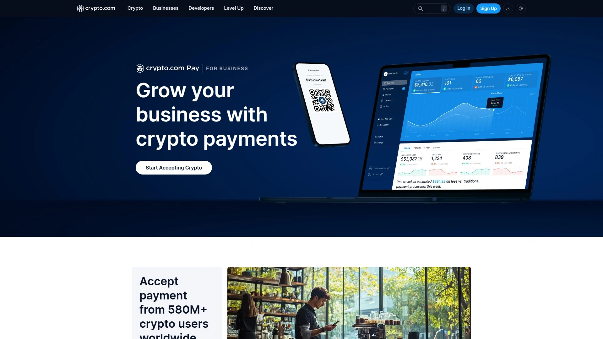

# 2025年排名前10的加密货币支付网关汇总(最新整理)

随着全球数字经济的快速发展,越来越多的商家开始接受加密货币作为支付方式。无论你是跨境电商、在线服务提供商,还是实体零售商,选择一个稳定、安全、手续费透明的加密货币支付网关至关重要。本文精选了2025年市场上最值得关注的10家加密货币支付平台,帮助你快速找到适合自己业务场景的解决方案,无论是降低跨境交易成本、扩大全球客户覆盖,还是提升资金到账速度。

---

## **[CoinPayments](https://coinpayments.net)**

全球领先的多币种加密货币支付处理平台,适合需要广泛数字资产支持的商家。

自2013年成立以来,CoinPayments已成为行业内历史最悠久的支付网关之一,为全球商家提供安全、即时且无国界的加密货币支付服务。平台支持超过100种主流加密货币,包括比特币、以太坊、稳定币及众多山寨币,让商家可以根据业务需求灵活选择接受的币种。

**技术优势与集成能力**

CoinPayments提供了完善的技术解决方案,包括API集成、WooCommerce/Shopify等主流电商平台插件、支付链接、POS系统、以及可定制的高容量处理方案。商家可以通过多种方式接入,无论是在线商城、订阅服务还是线下门店,都能快速部署加密货币支付功能。

平台还提供托管钱包服务,支持超过2000种数字货币的存储、发送和接收,并配备保险保护,让商家资金安全有保障。商家可以选择将收到的加密货币即时转换为稳定币、自动转发到指定钱包、或保留在托管账户中灵活管理。

**费用透明且灵活**

CoinPayments对所有入账支付和存款收取0.5%的固定费用,具体还需支付网络费用(根据使用的加密货币而定)。商家账户和钱包设置完全免费,没有隐藏费用,适合各种规模的企业使用。

平台还支持批量提款功能,商家可以从多个回调地址批量提取资金,只需支付一次交易费用,大大节省了运营成本。对于需要向全球供应商、员工或代理进行加密货币支付的企业,批量支付功能尤其实用。

***

## **[BitPay](https://www.bitpay.com)**

成熟的美国持牌加密货币支付处理商,适合注重合规与稳定性的中大型企业。

BitPay自2011年开始提供加密货币处理服务,年度处理峰值超过10亿美元,是业内最资深的支付处理商之一。平台支持比特币、以太坊、狗狗币等16种以上主流加密货币,覆盖全球70%的加密货币市值。

BitPay的核心优势在于其成熟的商家工具和合规体系,提供品牌化结账链接、部分/全额退款、批量支付、多币种结算等功能,特别适合需要传统支持和明确费用结构的零售商、订阅服务和B2B发票场景。商家可以选择将加密货币支付即时转换为150多种法定货币,完全规避价格波动风险,且不会面临拒付和身份欺诈风险。

平台采用分级定价模式,每笔交易收费为1-2%加0.25美元,覆盖范围广泛,在美国和欧盟地区尤其受欢迎。BitPay已处理超过1000万笔交易,服务范围覆盖229个国家和地区,支持38个国家的银行存款结算。其稳定的运营记录和清晰的政策使其成为合规敏感型企业的首选。

***

## **[Coinbase Commerce](https://www.coinbase.com/commerce)**

适合SaaS和创作者的简洁型加密货币支付方案,与Coinbase生态无缝集成。

Coinbase Commerce是由全球顶级加密货币交易所Coinbase推出的企业级数字支付服务,支持比特币、以太坊、狗狗币、USDC、USDT、DAI等多种主流加密货币。平台的最大特点是界面清晰、商家仪表板简洁易用,支持即时结算、低费用和广泛的资产支持。

**链上支付协议与安全性**

Coinbase Commerce基于链上支付协议构建,账户采用链上支付机制,完全消除了欺诈交易的可能性。客户支付的加密货币直接进入商家钱包,商家可以随时将资金转移到自己选择的钱包中。平台使用基于Google Authenticator的双因素认证机制,提供额外的安全保障层。

收取1%的交易费用,网络处理费由加密货币网络收取(非Coinbase收取)。商家可以通过加密货币交易所将收到的数字货币转换为法定货币,灵活管理资金。平台与Jumpseller、Primer、Shopify、WooCommerce等主流电商平台轻松集成。

Coinbase Commerce特别适合已经使用Coinbase账户的SaaS企业、创作者和小型企业,客户如果拥有Coinbase账户和钱包将获得更流畅的支付体验,但任何钱包都能与Coinbase Commerce配合使用。

***

## **[NOWPayments](https://nowpayments.io)**

币种覆盖广、非托管模式可选,适合大型企业和高交易量品牌。

NOWPayments是一个功能强大的加密货币支付网关,支持超过200种加密货币,为电商、SaaS、市场平台、游戏和Web3项目提供灵活的支付解决方案。平台最大的特色是提供白标签/自定义域名结账、非托管控制模式(可选托管模式)、可定制的网络费用设置,以及7×24小时在线客服支持。

NOWPayments的非托管模式让商家完全掌控资金流向,避免第三方托管风险,同时平台也提供托管余额选项供不同需求的商家选择。平台支持链上支付、发票、订阅、批量支付等多种功能,并提供可定制的仪表板用于追踪支付、管理发票、查看余额和生成详细报告。

对于需要快速自助入驻的企业,NOWPayments提供了简化的开通流程,而无需经历复杂的手动审核。平台费用透明且具有竞争力,是Forbes顾问评选的2025年度最佳加密货币支付网关,特别适合需要广泛币种支持、低费用和可定制工具的商家。

NOWPayments还支持自动转换功能,商家可以将收到的加密货币自动转换为稳定币,减少价格波动风险。对于需要向全球员工、供应商或代理批量支付的企业,平台的CSV/API批量支付功能可以大幅提升运营效率。

***

## **[CoinGate](https://coingate.com)**

欧盟合规的一站式加密货币支付与资金管理平台,适合注重监管合规的企业。

CoinGate是一个安全、合规的加密货币支付网关,提供低至1%的透明费用,支持全球范围内接受比特币、USDC等主流加密货币。平台不仅是支付处理商,更是一个完整的数字资产管理中心,商家可以存入、持有、转换和提取资金,所有操作都享有顶级安全保护。

**即时法币结算与无缝转换**

CoinGate允许商家全球范围内安全接受加密货币支付,且无拒付风险,同时可以选择即时将资金结算为欧元、英镑或美元,有效规避价格波动并简化会计流程。这一功能对于不希望持有加密货币但想提供数字货币支付选项的商家尤其有用。

平台支持向180多个国家发送加密货币,实现比传统SWIFT转账更快、更便宜的全球汇款,且无需复杂的开通、设置或维护费用。商家账户还可以作为资金管理工具,轻松存入加密货币和欧元,在货币之间转换,并直接向钱包或银行账户进行支付或提款。

**内置合规工具**

CoinGate完全遵守欧盟新指令,提供内置的AML/KYC工具确保无缝合规,让商家可以专注于业务增长而非繁琐的监管事务。平台还提供客户筛查和广泛的报告工具,支持无缝导出选项,帮助商家保持账目随时可审计状态。

CoinGate提供WooCommerce、WHMCS等主流平台的插件,方便快速集成。

***

## **[BTCPay Server](https://btcpayserver.org)**

开源自托管加密货币支付处理器,适合重视隐私和去中心化的技术型商家。

BTCPay Server是一个完全免费且开源的加密货币支付处理器,允许商家直接接收比特币(链上及闪电网络)和其他数字货币支付,零费用、零交易成本、无中间商。作为非托管发票系统,BTCPay完全消除了第三方介入,支付直接进入商家钱包,大幅提升隐私和安全性。

**完全的自主权与隐私保护**

BTCPay Server最显著的优势是商家拥有完全的资金控制权,接收支付无需提供私钥,每张发票使用新地址,避免地址重复使用问题。作为自托管软件,商家本身就是支付处理商,没有订阅费、交易费,也不存在审查风险。

平台内置钱包管理功能,支持硬件钱包,商家可以轻松管理进出资金。BTCPay还提供销售点应用、捐赠按钮嵌入、支付链接发送、众筹活动启动等多种场景应用。

对于不擅长技术的用户,可以使用共享服务器;技术型商家可以在云服务器或硬件设备上部署自己的实例,甚至可以分享服务器来支持朋友或本地社区。平台提供完整的API用于管理商店、发票、用户,实现工作流程自动化和访问控制。

BTCPay Server已帮助Namecheap通过110万笔交易实现超过7300万美元的比特币收入,在哥斯达黎加Bitcoin Jungle项目中支持200多家商店接受比特币。

***

## **[TripleA](https://www.triple-a.io)**

持有MAS和欧盟牌照的加密货币支付服务商,与Visa合作提供企业级解决方案。

TripleA是一家受新加坡金融管理局(MAS)许可并在欧盟获得监管批准的加密货币支付网关,提供全面的加密货币支付解决方案。作为2022年Visa加速器计划成员,TripleA与Visa合作支持企业接受和支付加密货币,同时完全规避价格波动风险。

平台支持比特币、闪电网络比特币、以太坊、USDC和USDT等主流加密货币,提供API集成、支付链接和购物车插件等多种支付方案,满足不同业务的具体需求。TripleA收取固定1.5%的交易费用,没有隐藏费用,确保透明且具竞争力的定价。

**核心服务与优势**

TripleA提供即时加密货币转法币功能和本地货币结算,简化支付流程且无额外成本。平台支持T+1本地货币结算、锁定汇率、兼容所有钱包、即时确认、拒付保护和白标签解决方案。

商家可以利用平台实现7×24小时实时支付,向全球供应商、商户、员工和自由职业者进行成本高效的即时跨境支付。TripleA还提供加密货币奖励功能,允许商家为终端用户轻松实施加密货币返现,吸引想要被动获取加密货币的消费者。

平台遵守严格的安全协议,符合国际反洗钱(AML)和了解你的客户(KYC)标准,为交易提供安全合规的环境。TripleA快速的交易处理速度和用户友好的工具,包括简单的API无缝集成和实时支付通知,提升了企业的运营效率。

***

## **[OpenNode](https://opennode.com)**

专注于比特币闪电网络支付的处理商,适合需要即时低成本交易的商家。

OpenNode是一个专业的比特币支付处理器,特别擅长闪电网络支付,为商家提供即时、低成本的比特币交易解决方案。闪电网络是比特币的第二层解决方案,通过链下支付通道实现几乎即时的交易确认和极低的手续费。

**闪电网络的技术优势**

与传统比特币链上交易需要6次网络确认不同,闪电网络支付可以实现零确认即时完成,非常适合现实世界的支付场景。平台支持微支付,用户可以发送和接收低至0.00000001 BTC(不到0.01美分)的比特币支付。

闪电网络上的所有比特币交易都发生在比特币区块链之外(链下),无需委托信任或所有权,用户可以进行无限次即时支付,大幅提升可扩展性。OpenNode与GAP600合作提供即时确认技术,GAP600的风险引擎可以即时分析交易并进行实时风险评分,自实施以来,超过85%的CoinPayments交易能够即时完成。

OpenNode提供简洁的销售点系统界面,商家只需添加书签到POS结账URL,输入客户需支付的金额并选择币种,即可生成地址和二维码接受支付。平台还支持WooCommerce集成,方便电商商家快速部署比特币和闪电网络支付。

对于希望利用比特币闪电网络实现即时低成本跨境支付的商家,OpenNode是理想的选择。

***

## **[Crypto.com Pay](https://crypto.com/en/pay-merchant)**

全球领先的加密货币平台推出的商家支付解决方案,适合希望接入庞大用户生态的企业。

Crypto.com Pay是由拥有超过5.8亿加密货币用户的Crypto.com平台推出的商家支付服务,让企业能够接受比特币和其他加密货币作为支付方式。平台提供超过20种现金和加密货币结算选项,包括美元、欧元、英镑、比特币和以太坊等。

**零加密货币价格风险**

Crypto.com Pay支持美元、欧元、英镑、澳元等多种法币现金结算选项,商家可以完全规避加密货币价格波动风险。平台年度处理金额超过3亿美元,支付处理仅需1秒即可完成。

商家可以通过预构建插件轻松集成Shopify、WooCommerce等流行电商平台,也可以使用SDK通过几行代码进行直接API集成,实现更高的定制化。对于不需要集成的商家,Crypto.com Pay仍提供自动发票、一次性卡支付等便利功能。

**丰富的商家生态系统**

加入Crypto.com Pay的商家可以被列入Crypto.com Pay目录,参与联合推广活动,并安装横幅小部件为客户提供额外的CRO代币奖励。平台支持一次性或订阅式加密货币支付(订阅支付仅适用于Crypto.com App用户)。

Crypto.com Pay还为B2B合作伙伴提供自动发票功能,并通过专用商家应用支持店内加密货币支付,无需POS集成。已有超过4000家商家信任并使用Crypto.com Pay,包括Adelaide Oval、OTR加油站、Xsolla Checkout等知名品牌。

***

## **[Alchemy Pay](https://alchemypay.org)**

连接法币与加密货币经济的混合型支付网关,支持多种支付轨道。

Alchemy Pay是一个专注于连接法币和加密货币全球经济的支付解决方案提供商,为商家提供灵活的加密货币收款和支付服务。平台支持多种支付轨道,既可以处理加密货币支付,也能实现法币入金和出金,为商家提供混合式支付基础设施。

Alchemy Pay的核心优势在于其混合支付能力,商家可以根据客户需求同时支持传统支付方式和加密货币支付。平台与多个电商平台和支付系统集成,提供API文档支持开发者快速接入。

对于希望在全球范围内扩展业务、同时支持法币和加密货币收款的企业,Alchemy Pay提供了一个全方位的解决方案。平台致力于桥接传统金融体系与区块链经济,让商家能够无缝地在两个世界之间切换。

***

## **[Bitrefill](https://www.bitrefill.com)**

专注于加密货币购买礼品卡和充值服务的平台,扩展数字货币实用性。

Bitrefill是一个独特的加密货币应用平台,让用户可以使用比特币和其他主流加密货币购买数百家零售商的礼品卡,包括亚马逊、Netflix、Uber、Spotify、Xbox等。自2011年成立以来,Bitrefill一直致力于扩展加密货币的实际使用场景。

平台支持以太坊、莱特币、比特币、达世币和狗狗币支付,也支持通过比特币快速闪电网络进行支付。Bitrefill目前在170个国家支持1650家企业,为全球超过40万客户提供服务。

**扩展加密货币的实用性**

Bitrefill的创新之处在于,即使某些零售商本身不接受加密货币,用户也可以通过购买礼品卡的方式使用数字货币消费。这一模式极大地扩展了加密货币的可用性,让其成为像法定货币一样实用的支付工具。

2022年,Bitrefill推出了账单支付服务,美国用户可以使用比特币支付信用卡账单、水电费、医疗费用、抵押贷款等超过20000种账单类型。平台收取2%的便利费用以覆盖账单支付和处理成本。

根据数据分析师Matt Ahlborg的研究,以太坊在Bitrefill上的金融交易价值最高,这得益于以太坊庞大的生态系统,包括智能合约、DeFi项目和NFT。Bitrefill为希望在日常生活中真正使用加密货币的用户提供了实用的解决方案。

***

## 常见问题

**如何选择适合自己业务的加密货币支付网关?**

选择支付网关时需要考虑几个关键因素:首先评估你的业务规模和交易量,大型企业可能需要NOWPayments或BitPay这类提供专属支持的平台,小型商家则可以选择CoinPayments或Coinbase Commerce这类入门门槛低的方案。其次要看支持的币种范围,如果客户群体多样化,CoinPayments和NOWPayments支持的币种更广泛。最后考虑是否需要即时转换为法币规避波动风险,BitPay、CoinGate和TripleA都提供法币即时结算功能。

**加密货币支付网关的费用结构是怎样的?**

不同平台的费用模式各有差异,大多数平台采用固定百分比收费模式。CoinPayments收取0.5%的入账费用,是行业内较低的费率。BitPay采用1-2%加0.25美元的分级定价。Coinbase Commerce收取1%交易费。CoinGate和TripleA的费用为1-1.5%。BTCPay Server完全免费,但需要自行部署和维护。除了平台费用,商家还需要考虑网络费用(由区块链网络收取)和可能的法币转换费用。

**使用加密货币支付网关需要多长时间才能收到资金?**

资金到账时间取决于选择的结算方式和所使用的区块链网络。如果选择保留加密货币,资金通常在区块链确认后立即到达商家钱包,比特币一般需要10-60分钟,以太坊约15分钟,而闪电网络可以实现即时确认。如果选择转换为法币,BitPay和TripleA提供T+1结算(即次日到账),CoinGate支持即时转换为欧元、英镑或美元。对于高交易量商家,部分平台还提供更快的定制化结算方案。

***

## 立即开始接受加密货币支付

选择合适的加密货币支付网关可以帮助你的业务触达全球数亿加密货币用户,降低跨境支付成本,提升资金到账效率。对于需要广泛币种支持、稳定运营记录和灵活结算方式的商家,**[CoinPayments](https://coinpayments.net)** 凭借其12年的行业经验、支持100+种加密货币、0.5%的透明费率以及完善的API和插件生态,特别适合跨境电商、在线服务和多币种收款场景。无论你是刚开始探索加密货币支付,还是希望优化现有支付流程,以上平台都能为你的业务增长提供有力支持。
